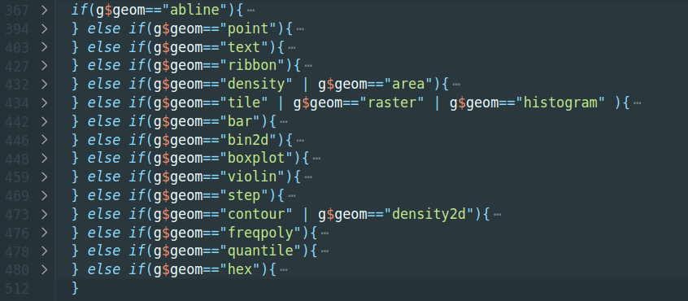

Hi, I'm Himanshu Singh(@lazycipher). In this post, I'll be sharing things that I've been doing from August 1, 2020 - August 24, 2020 i.e the third coding period.

#### What I did during the 3rd coding period?
In the last coding period, I had to move `geom` specific calculation to  `geom` specific class definitions. Earlier the sqquence was that when you invoke `animint2dir()`, it used to call `savelayer()` for each layer and `saveLayer()` used to calculate all the needed data for animint2. In this approach, we had to check `geom$` type of each and every layer and then calculate needed data for them and move ahead. This caused a big `if(){} else{}` block which made the maintainability readability of code.



We had to get rid of this block by using OOPs concept. In order to solve this, we created a `pre_process()` method in the base `Geom` class. Now we moved all the geom specific code which was responsible for geom specific pre processing/calculations to the `pre_process()` method of those specific geom class definitions.

This allowed us to execute specific code by just calling `GeomClass$pre_process()`.

For example, let's see how we moved calculation of geom `abline`. The class `GeomAbline`, we've a new method called `pre_process()` which can be accessed by `GeomAbline$pre_process(...)`.

```R
  pre_process = function(g, g.data, ranges) {
    for(i in 1:nrow(g.data)) {
    g.data[i, "x"] <- ranges[[ g.data$PANEL[i] ]]$x.range[1]
    g.data[i, "xend"] <- ranges[[ g.data$PANEL[i] ]]$x.range[2]
    g.data[i, "y"] <- g.data$slope[i] * g.data$x[i] + g.data$intercept[i]
    g.data[i, "yend"] <- g.data$slope[i] * g.data$xend[i] + g.data$intercept[i]
    if(g.data$y[i] < ranges[[ g.data$PANEL[i] ]]$y.range[1] ) {
        g.data$y[i] <- ranges[[ g.data$PANEL[i] ]]$y.range[1]
        g.data$x[i] <- (g.data$y[i] - g.data$intercept[i]) / g.data$slope[i]
    }
    if(g.data$yend[i] > ranges[[ g.data$PANEL[i] ]]$y.range[2]) {
        g.data$yend[i] <- ranges[[ g.data$PANEL[i] ]]$y.range[2]
        g.data$xend[i] <- (g.data$yend[i] - g.data$intercept[i]) / g.data$slope[i]
    }
    }
    g$aes <- g$aes[names(g$aes)!="group"]
    g.data <- g.data[! names(g.data) %in% c("slope", "intercept")]
    g$geom <- "segment"
    return(list(g = g, g.data = g.data))
  }
```

After the current implementation, the if else block is now replaced with the following code:

```R
processed_values <- l$geom$pre_process(g, g.data, ranges)
g <- processed_values$g
g.data <- processed_values$g.data
```

It really improved the redability and it'll help in maintaining the code in future.

The second change was moving the code which was responsible for common pre processing/calculations to a new method `export_animint()` which invokes the `pre_processing()`. Now the `saveLayer()` function is replaced with `export_animint()`. Which is now being called inside `animint2dir()` using `Geom$export_animint(...)`.

At the end, I updated the needed documentation so that animint2 can again be deployed on cran.

After this, the PR was merged to master branch and now it's submitted to CRAN so that it can be made available for everyone.

#### Any unsolved issue?

The implementation of new aesthetics to work with selected data is in progress as of now.

#### Anything I messed up?

Yes, Initially I was having issues in figuring out how do I implement this using OOPs but later on with the help of Mr. Toby, we figured it out, implemented and solved this issue.
